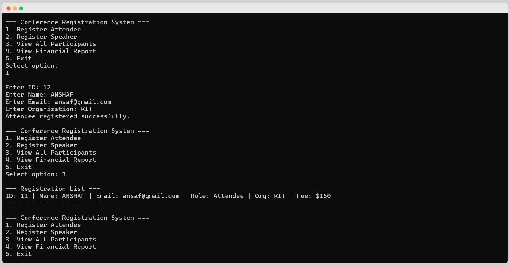

<div align="center">

  

  # 🎟️ Conference Registration System
  
  **An Advanced C++ OOP Application utilizing Inheritance, Polymorphism, and File Persistence.**

  <!-- Badges -->
  <p>
    
    
    
  </p>

</div>

## 📖 Overview
This system streamlines the management of conference participants. It differentiates between standard **Attendees** (who pay fees) and **Speakers** (who attend for free). It ensures data persistence by saving records to a local file.

---

## 🏗️ Architecture & OOP Concepts

| Concept | Implementation |
| :--- | :--- |
| **Inheritance** | `Person` is the base class. `Attendee` and `Speaker` inherit from it. |
| **Polymorphism** | Uses `virtual` functions for `calculateFee()` and `display()` to handle different logic dynamically. |
| **Encapsulation** | All data fields are `protected` or `private`, accessed via public methods. |
| **Operator Overloading** | `operator<<` is overloaded for easy object printing. |
| **File I/O** | `Manager` class handles saving and loading data from `registrations.txt`. |

---

## 🚀 Features

*   **Role-Based Registration:** Register users as either Attendees or Speakers.
*   **Automated Fee Calculation:** Speakers get free entry; Attendees are charged.
*   **Data Persistence:** Data is automatically saved and reloaded upon restart.
*   **Financial Reporting:** Calculate total revenue from registrations.

---

## 💻 Output Screenshot

<div align="center">
  <!-- Replace with your actual screenshot -->
  <a href="assets/output.png" target="_blank">
    
  </a>
</div>

---

## 🛠️ How to Run

1.  **Compile:**
    ```bash
    g++ -Iinclude src/*.cpp -o conference_app
    ```

2.  **Run:**
    ```bash
    ./conference_app.exe
    ```

## 👨‍💻 Author
**Mohammed Anshaf A**<br>
***BE.CSE, KIT-CBE**